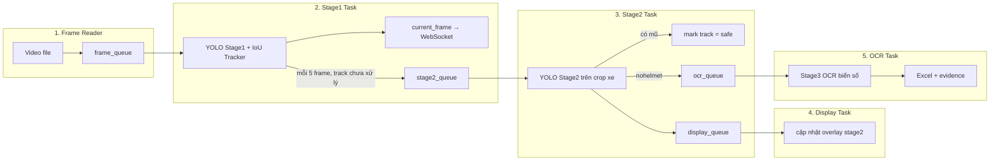

# TTCS AI Helmet — Hệ thống Giám sát Vi phạm Giao thông

Demo phát hiện **xe máy không đội mũ bảo hiểm** từ video, gồm tracking, OCR biển số, dashboard tiếng Việt và lưu minh chứng.

- **GitHub (code):** https://github.com/2vhoc/TTCS_AI_Helmet
- **Hugging Face (model):** https://huggingface.co/2vhoc/helmet-detection-traffic

---

## Tính năng

| Module | Mô tả |
|--------|--------|
| Stage 1 | YOLO phát hiện người đi xe máy trên frame |
| Stage 2 | YOLO trên crop xe: `helmet` / `nohelmet` / `licenseplate` |
| Stage 3 | YOLO OCR từng ký tự biển số + rule-based hậu xử lý |
| Tracking | IoU tracker gán ID ổn định, NMS trong frame |
| Realtime UI | WebSocket stream JPEG + metadata FPS/queue |
| Lưu trữ | Excel vi phạm + ảnh xe/biển/frame |
| Dedup | Chống ghi trùng theo biển số hoặc vị trí bbox (10s) |

---

## Pipeline thực tế

Mỗi video chạy **5 coroutine song song**, nối với nhau qua **4 asyncio queue** (max 50, drop-oldest khi đầy):



### Luồng chi tiết

1. **Frame Reader** — đọc video, giới hạn `TARGET_FPS`, đẩy `(frame_idx, frame)` vào `frame_queue`.
2. **Stage1 Task** — lấy frame → detect xe máy (thread pool) → cập nhật tracker → **vẽ bbox lên stream ngay** (không chờ stage2/OCR). Cứ **5 frame** lấy các track `pending` đẩy sang `stage2_queue`.
3. **Stage2 Task** — crop từng xe → detect mũ/biển (batch). Có **helmet** → đánh dấu `safe`, bỏ qua. Có **nohelmet** → đẩy `ocr_queue`. Kết quả stage2 cũng vào `display_queue` để UI cập nhật nhanh.
4. **Display Task** — lấy từ `display_queue`, refresh overlay (không block OCR).
5. **OCR Task** — lấy từ `ocr_queue` → crop biển số → Stage3 OCR → dedup → ghi Excel + lưu ảnh minh chứng.

**Lưu ý:** Stream chính do Stage1 cập nhật liên tục; nhánh vi phạm (stage2 → OCR → lưu) chạy **bất đồng bộ phía sau**, tách queue để UI không bị kẹt khi OCR chậm.

### Backend inference

| Flag | Stage 1–3 |
|------|-----------|
| `--code python` | Ultralytics PyTorch (`.pt`) |
| `--code cpp` | ONNX Runtime qua `onnx_backend.py` (`.onnx`, GPU) |

---

## Cài đặt & chạy

```bash
pip install -r requirements.txt

# Tải model từ Hugging Face (bắt buộc trước khi chạy)
bash scripts/download_models.sh

# PyTorch backend
python run.py
# hoặc
bash start.sh --code python

# ONNX backend (nhanh hơn trên GPU)
bash start.sh --code cpp
```

Mở http://localhost:8000 — đăng nhập `1` / `1`.

---

## API chính

| Method | Endpoint | Mô tả |
|--------|----------|--------|
| POST | `/api/auth/login` | Đăng nhập |
| POST | `/api/videos/upload` | Upload video |
| POST | `/api/videos/{id}/start` | Bắt đầu pipeline |
| POST | `/api/videos/{id}/stop` | Dừng pipeline |
| GET | `/api/violations` | Danh sách vi phạm |
| GET | `/api/violations/{id}/evidence/{type}` | Ảnh minh chứng (`vehicle` / `plate` / `frame`) |
| GET | `/api/status/{video_id}` | FPS, queue size, số vi phạm |
| WS | `/ws/stream/{video_id}` | Stream JPEG + JSON metadata |

---

## Cấu trúc thư mục

```
app/
├── main.py
├── core/config.py              # Toàn bộ threshold, ROI, queue
├── api/                        # auth, video, violations, webrtc
├── services/
│   ├── inference/
│   │   ├── pipeline.py         # 5-task async pipeline
│   │   ├── stage1_motorbike_detector.py
│   │   ├── stage2_part_detector.py
│   │   ├── stage3_helmet_ocr.py
│   │   ├── onnx_backend.py     # Backend --code cpp
│   │   └── plate_postprocessor.py
│   ├── realtime/tracker.py     # IoU tracking + within-frame NMS
│   ├── video/                  # reader, frame_utils
│   └── storage/                # Excel + evidence images
├── frontend/                   # Dashboard tiếng Việt
compare-test/                   # Benchmark PT vs ONNX, pipeline test
scripts/
├── download_models.sh
└── export_onnx.py
models/                         # Tải từ Hugging Face (không commit weight)
storage/
├── uploads/                    # Video upload (.gitkeep)
├── evidence/                   # Ảnh vi phạm (.gitkeep)
└── violations/                 # violations.xlsx + reports (.gitkeep)
dataset_plate/                  # Dataset huấn luyện (legacy)
helmet.yaml / plate.yaml
```

---

## Cấu hình (`app/core/config.py`)

| Tham số | Mặc định | Ý nghĩa |
|---------|----------|---------|
| `STAGE1_CONF` | 0.4 | Ngưỡng detect xe máy |
| `STAGE2_CONF` | 0.72 | Ngưỡng helmet / nohelmet / biển số |
| `STAGE3_CONF` | 0.25 | Ngưỡng OCR từng ký tự |
| `STAGE1_IMGSZ` / `STAGE2_IMGSZ` | 320 | Input YOLO stage 1–2 |
| `TARGET_FPS` | 30 | FPS đọc video |
| `VIOLATION_PROCESS_EVERY_N_FRAMES` | 5 | Tần suất gửi track sang stage2 |
| `QUEUE_MAX_SIZE` | 50 | Max 4 queue (drop-oldest) |
| `ENABLE_ROI` | True | Stage1 chỉ quét 45%–100% chiều cao frame |
| `FULL_FRAME_DETECT_EVERY_N_FRAMES` | 60 | Mỗi 60 frame quét full frame 1 lần |
| `ENABLE_DETECTION_LINE` | True | Python backend: lọc bbox dưới vạch 55% |
| `ENABLE_DETECTION_ZONE` | True | ONNX backend: vùng giữa 1/3 frame |
| `DEDUP_SECONDS` | 10 | Chống ghi trùng vi phạm |

---

## Yêu cầu hệ thống

- Python 3.10+
- GPU NVIDIA + CUDA (khuyến nghị)
- RAM 16GB+

---

## Dataset training (legacy)

Thư mục `dataset_plate/`, file `helmet.yaml`, `plate.yaml` — dữ liệu và config huấn luyện YOLO gốc, giữ trong repo để tham chiếu.
